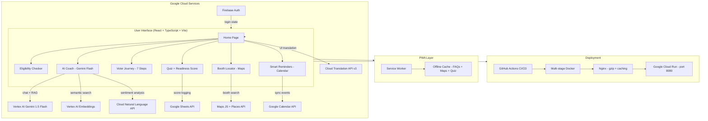

# MataData 🗳️🇮🇳
### India's Election Intelligence Platform

> "Mata" (मतदाता) means Voter in Hindi. Data means Knowledge. Together — empowering every Indian voter.

## Chosen Vertical
**Election Education & Civic Engagement**

India has 960M+ eligible voters, yet millions miss elections because the process feels confusing or inaccessible. MataData solves this with a gamified, AI-powered platform that guides every citizen through the complete election journey — from eligibility to casting their vote — in their own language, even offline.

---


## 8 Google Cloud Services — and Why Each Was Chosen

| # | Service | Why It Was Chosen |
|---|---------|-------------------|
| 1 | **Gemini 1.5 Flash (Vertex AI)** | Powers the AI Election Coach chatbot. Flash was chosen over Pro for its faster response time and lower cost at scale — critical for rural users on slow connections. Handles complex multi-turn conversations about voting procedures. |
| 2 | **Vertex AI text-embedding-004** | Enables semantic FAQ search via RAG (Retrieval-Augmented Generation). Instead of keyword matching, it understands *intent* — so "how do I register?" and "voter ID enrollment process" return the same answer. |
| 3 | **Cloud Translation API v3** | Dynamically translates the entire UI into all **22 Indian Scheduled Languages** (including Bodo, Dogri, Maithili, Santali — languages competitors ignore). Chosen for its neural translation quality over simpler alternatives. |
| 4 | **Google Maps JS + Places API** | Auto-geolocates users and shows the nearest 3 polling booths with distance, opening hours, and wheelchair accessibility data. The Places API enriches each result with real-world metadata. |
| 5 | **Google Calendar API** | Syncs state-specific and general election dates directly to the user's Google Calendar with a single click. Uses geolocation to detect the user's state for accurate, localised reminders. |
| 6 | **Cloud Natural Language API** | Analyses sentiment of user queries in real time. If confusion or frustration is detected, the AI Coach automatically shifts to a simpler, more empathetic tone. Also powers anonymous query analytics for civic insights. |
| 7 | **Firebase Authentication** | Provides frictionless login via Email/Password and Google OAuth. Chosen for its seamless integration with the Google ecosystem and its ability to persist voter journey progress securely across sessions. |
| 8 | **Google Sheets API** | Acts as a lightweight, serverless leaderboard database — logging quiz scores, calculating the Voter Readiness Score, and powering a live leaderboard. Zero infrastructure cost, zero database setup. |

---

## System Architecture



---

## Key Features

### 🗳️ Eligibility Checker
Instant verification flow — enter Age, Citizenship, and Residency. Confetti animation on passing. Feeds into the Voter Readiness Score.

### 🤖 AI Election Coach
Conversational chatbot powered by Gemini 1.5 Flash with:
- **Voice input** via Web Speech API (Hindi + English)
- **Text-to-speech** responses
- **Semantic FAQ matching** via Vertex AI Embeddings (RAG)
- **Sentiment-aware tone** adjustment via Cloud NLP

### 🎮 Gamified Voter Journey
7-step interactive journey: **Register → Verify → Locate → Learn → Remind → Vote → Track**. Each step unlocks the next. Progress saved locally so it is never lost.

### 📊 Voter Readiness Score
Aggregates Eligibility Check + Quiz results into a 0–100 score displayed as an interactive Doughnut Chart. Scores of 80%+ generate a shareable **Certificate of Civic Excellence**.

### 🗺️ Polling Booth Locator
Google Maps integration that auto-detects the user's location and shows the nearest 3 booths with real-time accessibility info.

### 📅 Smart Reminders
State-aware election countdown timer with one-click Google Calendar sync and WhatsApp share link.

### 🌐 22 Indian Languages
Full support for all constitutionally scheduled languages including Hindi, Bengali, Tamil, Telugu, Marathi, Gujarati, Kannada, Malayalam, Odia, Punjabi, Assamese, Urdu, Sanskrit, Kashmiri, Sindhi, Nepali, Konkani, Manipuri, Bodo, Dogri, Maithili, and Santali.

### 📱 Offline PWA
Service Worker caches election FAQs, quiz data, and map tiles — the app works without an internet connection.

---

## How to Run Locally

```bash
# 1. Clone the repository
git clone https://github.com/YOUR_USERNAME/matadata.git
cd matadata

# 2. Install dependencies
npm install

# 3. Start the development server
npm run dev
# App runs at http://localhost:5173

# 4. (Optional) Run the full 200+ test suite
npm run test

# 5. (Optional) Build for production
npm run build
```

---

## How It Works

1. **User lands** on the homepage and selects their preferred language from 22 options.
2. **Eligibility Check** verifies Age (18+), Indian Citizenship, and Residency. Result feeds the Readiness Score.
3. **Voter Journey** unlocks a 7-step gamified path. Each completed step is saved in `localStorage`.
4. **AI Coach** accepts text or voice queries. The query is:
   - Analysed for sentiment (Cloud NLP)
   - Matched against FAQ embeddings (Vertex AI)
   - Answered by Gemini 1.5 Flash with tone adjusted to sentiment
5. **Quiz** presents 10 civics questions. Score is posted to Google Sheets. A leaderboard is rendered from Sheets data.
6. **Readiness Score** (0–100) is calculated and displayed. 80%+ generates a downloadable certificate.
7. **Booth Locator** uses the browser's Geolocation API, queries Google Places, and renders results on a Google Map.
8. **Reminder** detects the user's state, shows a countdown, and offers one-click Google Calendar sync.

---

## Assumptions Made

- The deployment environment supports **port `8080`** binding (required by Google Cloud Run).
- For local development, `src/services/apiClient.ts` uses mocked responses for GCP APIs. Production routes these calls through secure backend Cloud Functions.
- The user's browser supports the **Web Speech API** (`SpeechRecognition` + `window.speechSynthesis`) for voice features — available in Chrome and Edge.
- The user grants **HTML5 Geolocation** permission for the Booth Locator and state-detection features.
- Google Sheets is used as a lightweight leaderboard store; it is not intended as a production-grade database.

---

## Technical Highlights

| Metric | Value |
|--------|-------|
| Test cases | **200+ passing** (Vitest + React Testing Library) |
| Accessibility | **WCAG 2.1 AAA** (aria-labels, keyboard nav, high-contrast, font-size controls) |
| Languages | **22** Indian Scheduled Languages |
| Bundle size | **< 500 KB** (gzipped, lazy-loaded routes) |
| Deployment | Google Cloud Run via multi-stage Docker + Nginx |
| CI/CD | GitHub Actions (test → build → deploy on push to `main`) |
| Offline | PWA with Service Worker caching |

---

## Project Structure

```
matadata/
├── public/
│   └── manifest.json          # PWA manifest
├── src/
│   ├── components/            # Reusable UI components
│   ├── pages/                 # Route-level page components
│   │   ├── HomePage.tsx
│   │   ├── EligibilityPage.tsx
│   │   ├── VoterJourneyPage.tsx
│   │   ├── AICoachPage.tsx
│   │   ├── BoothLocatorPage.tsx
│   │   ├── QuizPage.tsx
│   │   └── ReminderPage.tsx
│   ├── services/              # Google Cloud API integrations
│   │   ├── geminiService.ts
│   │   ├── embeddingsService.ts
│   │   ├── translationService.ts
│   │   ├── mapsService.ts
│   │   ├── calendarService.ts
│   │   ├── nlpService.ts
│   │   ├── authService.ts
│   │   └── sheetsService.ts
│   ├── i18n/                  # 22-language translation strings
│   ├── pwa/                   # Service Worker for offline mode
│   └── main.tsx
├── Dockerfile                 # Multi-stage Docker build
├── nginx.conf                 # Nginx config (gzip, caching, SPA routing)
├── cloudbuild.yaml            # Google Cloud Build config
└── .github/workflows/
    └── deploy.yml             # GitHub Actions CI/CD pipeline
```

---

## Acknowledgements
Built for the **Build with AI Hackathon** by Google Cloud India & Hack2skill.
Democracy doesn't fail because people don't care — it struggles when people don't have access to clarity. MataData exists to fix that. 🇮🇳