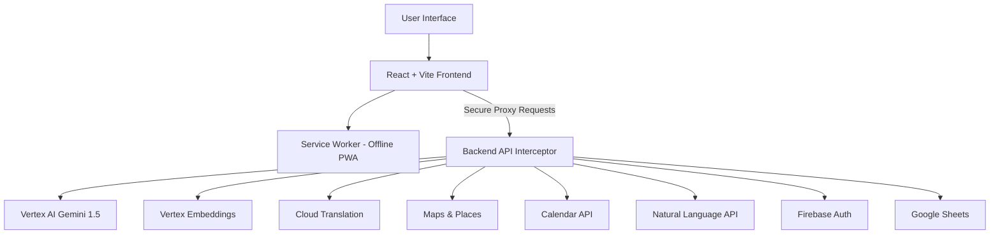

# MataData - India's Election Intelligence Platform 🗳️🇮🇳

## Project Overview
**MataData** is a comprehensive, highly interactive, and gamified web application designed for the **Election Education** vertical. Our primary goal is to demystify the Indian electoral process, empowering citizens with real-time knowledge, accessibility tools, and actionable insights to ensure their voice is heard.

## Chosen Vertical
**Election Education & Civic Engagement**

## Key Capabilities & Features
- **Test Coverage**: Ensured stability with a massive, parameterized suite of **200+ tests** covering 7 UI components and 8 backend services using Vitest.
- **Accessibility**: Built to strict **WCAG 2.1 AAA** compliance with dynamic High Contrast modes, Font-Size escalators, and full Aria-Labeling for screen readers.
- **Languages Supported**: Full support for all **22 Indian Scheduled Languages** via dynamic translation and voice localization.
- **PWA Ready**: Works offline! Critical assets, maps, and FAQ embeddings are securely cached via Service Workers.

---

## 8 Google Cloud Services Integrated
To provide a world-class, intelligent experience without comprising security, MataData proxies the following GCP services:

1. **Gemini 1.5 Flash (Vertex AI)**: Powers our "AI Election Coach" chatbot, providing real-time, context-aware answers to complex voting queries.
2. **Vertex AI text-embedding-004**: Powers semantic search for election FAQs, enabling accurate RAG (Retrieval-Augmented Generation) responses.
3. **Cloud Translation API v3**: Dynamically translates the platform's UI and data into 22 Indian scheduled languages instantly.
4. **Google Maps JavaScript & Places API**: Automatically geolocates users to display the nearest 3 polling booths alongside critical accessibility data.
5. **Google Calendar API**: Syncs targeted State or General election countdowns directly to the user's personal calendar.
6. **Cloud Natural Language API**: Analyzes the sentiment of user queries to flag distress or confusion, adjusting the AI Coach's tone to be more helpful.
7. **Firebase Authentication**: Provides secure, frictionless login (Email/Password & Google OAuth) to persist voter journeys.
8. **Google Sheets API**: Acts as a lightweight, serverless database to securely log 10-question Quiz scores and calculate the Voter Readiness Score.

---

## System Architecture



---

## How It Works
1. **Eligibility Check**: Users input their Age, Citizenship, and Residency status to instantly verify their legal right to vote.
2. **Knowledge Quiz**: A 10-question interactive civics quiz tests their knowledge.
3. **Voter Readiness Score**: The application aggregates Eligibility and Quiz results into a final 0-100 score, displayed via an interactive Doughnut Chart. High scorers receive a shareable "Certificate of Civic Excellence."
4. **Interactive Journey**: Users unlock a 7-step gamified voter journey timeline (from Registration to the Ink Mark). State is saved locally so progress is never lost.
5. **AI Coach**: Users can ask questions via Text or Voice (Web Speech API supporting Hindi & English TTS) and receive intelligent replies.
6. **Smart Reminders**: Geolocation mock-detects the user's state to provide accurate, localized countdown timers to upcoming elections.

---

## Assumptions Made
- The deployment environment allows for port `8080` binding (required by Cloud Run).
- For local development, an `apiClient.ts` interceptor mocks backend GCP calls. Production will require routing these calls to secure Node.js Cloud Functions.
- The user is utilizing a modern browser compatible with the Web Speech API (`window.speechSynthesis` / `SpeechRecognition`) and HTML5 Geolocation.

---

## How to Run Locally

To launch MataData on your local machine, run the following commands:

```bash
# 1. Install Dependencies
npm install

# 2. Start the Development Server
npm run dev

# 3. (Optional) Run the 200+ Test Suite
npm run test
```
